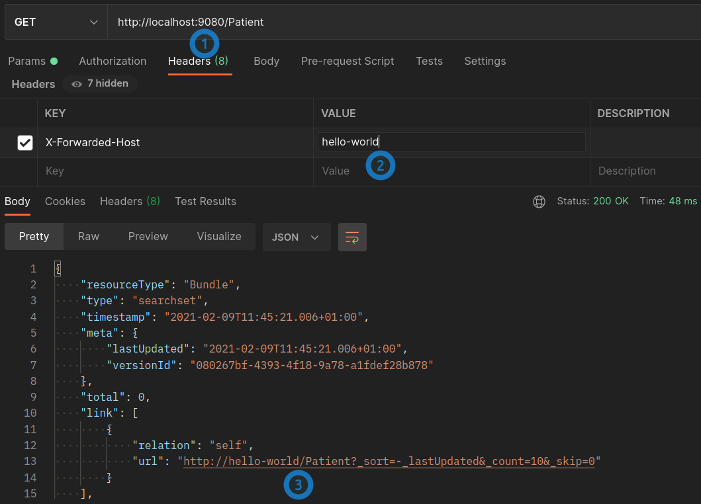

# Introduction

This plugin makes Firely Server 3.9.3 respect the `X-Forwarded-For`, `X-Forwarded-Proto`, and `X-Forwarded-Host` headers which can be used to specify the original request information. In effect, this makes the server use the correct base URL when running behind an API gateway or proxy.

See screenshot below where the original URL (1) is modified to a different value (2) and is reflected in the server's response (3):

# Notes

This only works with Firely Server 3.9.3 - to change to another version, update `<VonkVersion>3.9.3</VonkVersion>` in `Vonk.Plugin.UseForwardHeadersMiddleware.props` and rebuild the plugin.